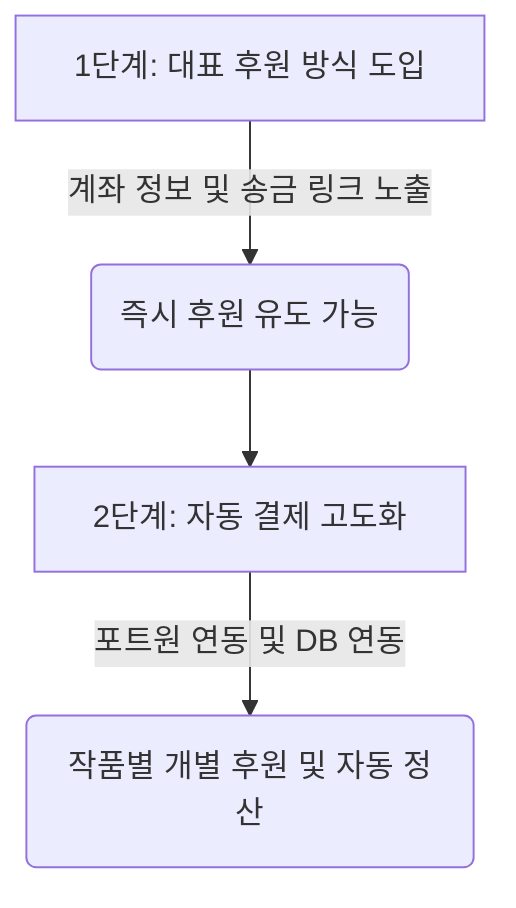

# S&J드림아카이브 후원 결제 시스템 구축 방안

본 문서는 S&J드림아카이브 서비스에 후원 결제 기능을 도입하기 위한 단계별 방안과 기술적 검토 사항을 정리한 문서입니다.

---

## 1. 후원 방식 비교 및 기술 검토

### 방안 A. 개별 작품 후원하기 (포트원 API 연동)
각 작품 상세 페이지 내에서 관람객이 마음에 드는 작품을 선택하여 개별적으로 후원하는 방식입니다.

* **동작 방식:**
  1. 작품 상세 페이지(`Detail.jsx`) 하단에 '후원하기' 버튼 배치
  2. 클릭 시 후원 금액 선택 리스트(1천원, 3천원, 5천원, 7천원, 1만원) 표시
  3. 결제 수단(신용카드, 계좌이체, 카카오페이 등) 선택 후 포트원(Portone) 결제창 연동
  4. 결제 완료 시, Supabase DB의 `donations` 테이블에 `(work_id, amount, status)` 형태로 저장
* **장점:** 관람객이 특정 작가나 작품을 직접 지정하여 응원할 수 있어 참여율이 높고 피드백이 직관적임.
* **단점:** PG 가입 및 심사(사업자등록/비영리증 필요)가 수반되며, 작품 ID 매핑을 위한 데이터베이스 설계 및 결제 연동 처리가 추가적으로 필요함.

### 방안 B. 대표 후원하기 (대표 계좌 및 송금 링크 제공)
메인 화면 또는 단일 후원 페이지를 통해 아카이브 전체에 대표 계좌(혹은 송금 링크)로 후원하는 방식입니다.

* **동작 방식:**
  1. 메인 페이지(`Home.jsx`) 또는 푸터, 배너 영역에 '청소년 드림아카이브 후원하기' 영역 노출
  2. 후원 전용 계좌번호(은행명, 예금주) 및 계좌 복사 버튼 제공
  3. 모바일 편의성을 위해 **토스 송금 링크** 또는 **카카오페이 QR 코드** 연동
* **장점:** 별도의 결제 모듈 연동이나 복잡한 승인 절차 없이 즉시 구현 가능하며 수수료가 발생하지 않음.
* **단점:** 실시간 결제 완료 여부를 시스템이 자동으로 감지할 수 없어, 수동으로 확인 및 반영해야 함.

---

## 2. 단계별 구축 로드맵 (초기 단순 시작안)

제작 공수 및 즉각적인 반영을 위해 **[1단계: 대표 후원]**으로 신속하게 시작한 뒤, 필요시 **[2단계: PG 결제 자동 연동]**으로 고도화하는 방안을 권장합니다.

### [1단계] 대표 계좌 및 송금 링크 노출 (현재 진행 예정)
* **목표:** 개발을 최소화하고 즉각적으로 후원금을 수령할 수 있는 통로 마련
* **필요 작업:**
  1. 후원용 대표 계좌 확정 (예: 은행명, 계좌번호, 예금주)
  2. 모바일 송금을 지원할 토스 송금 링크(Toss Link) 또는 카카오페이 송금 링크 준비
  3. 아카이브 메인 페이지 및 소개 영역에 후원 안내 컴포넌트 추가

### [2단계] 포트원 API를 이용한 자동 결제 및 작품별 후원 연동
* **목표:** 결제 수수료가 발생하더라도 간편 결제(카드/카카오페이 등)와 작품 매핑을 자동화
* **필요 작업:**
  1. PG사 가입 및 승인 (사업자등록증 또는 고유번호증 준비)
  2. Supabase 내 `donations` 테이블 생성
  3. 포트원(Portone) SDK 연동 및 Webhook 설정 (결제 완료 확인용)
  4. 작품 상세 페이지에 금액 선택 모달 및 결제 완료 후 DB 적재 로직 구현
